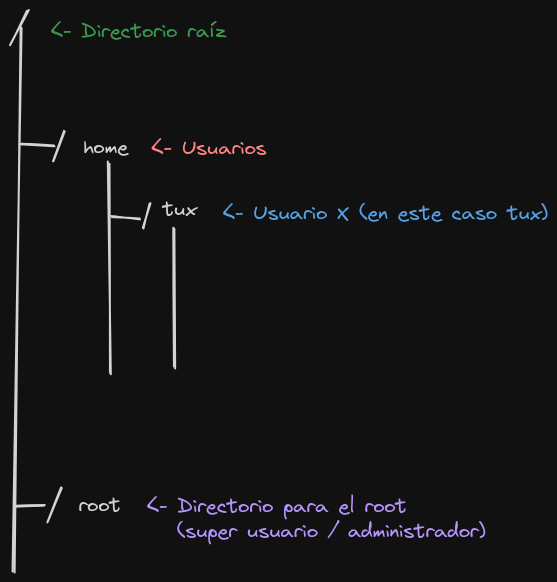
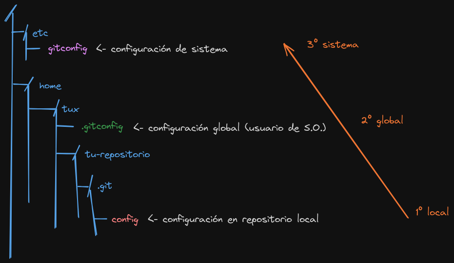
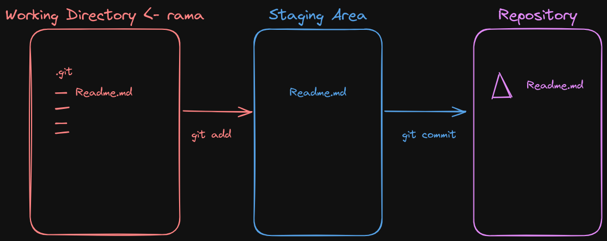

# Comandos Git

## Estructura de directorios Linux



## Configuración de usuario de Git



### Mostrar configuración de Git

```
git config --list
```

### Configurar datos del usuario

#### A nivel local (repositorio local)

```
git config user.name "Tu nombre"
git config user.email "Tu nombre"
```

o bien
```
git config --local user.name "Tu nombre"
git config --local user.email "Tu nombre"
```

```
git config --list

core.repositoryformatversion=0
core.filemode=true
core.bare=false
core.logallrefupdates=true
user.name=jc-local      ← LOCAL
user.email=jc@local.com ← LOCAL
```

#### A nivel global (usuario)

```
git config --global user.name "Tu nombre"
git config --global user.email "Tu nombre"
```

```
git config --list

user.name=jc-global      ← GLOBAL
user.email=jc@global.com ← GLOBAL
core.repositoryformatversion=0
core.filemode=true
core.bare=false
core.logallrefupdates=true
user.name=jc-local      ← LOCAL
user.email=jc@local.com ← LOCAL
```

#### A nivel de sistema (pc / computador / ordenador)

```
sudo git config --system user.name "Tu nombre"
sudo git config --system user.email "Tu nombre"
```

```
git config --list

user.name=jc-system      ← SYSTEM
user.email=jc@system.com ← SYSTEM
user.name=jc-global      ← GLOBAL
user.email=jc@global.com ← GLOBAL
core.repositoryformatversion=0
core.filemode=true
core.bare=false
core.logallrefupdates=true
user.name=jc-local      ← LOCAL
user.email=jc@local.com ← LOCAL
```

#### Eliminar configuración de usuario

```
sudo git config --system --unset user.name
sudo git config --system --unset user.email

git config --global --unset user.name
git config --global --unset user.email

git config --local --unset user.name
git config --local --unset user.email
```


## Manejo básico de repositorio




### Inicializar repositorio

```
git init nombre_repo
```

### Mostrar el estado del repositorio

```
git status
```


### Añadir archivo sin seguimiento al Staging Area

```
git add nombre_archivo
```

### Añade TODOS los archivos sin seguimiento al Staging Area

```
git add .
```

### Sacar archivos del Staging Area

```
git restore --staged <archivo>
```

### Confirmar cambios del Staging Area al Local Repository

```
git commit -m "mensaje"
```


## Flujo de trabajo básico

```
Inicializar repo → crear archivos → Añadir al stage → Añadir al repositorio

            Lo haces con:

git init         →  ide / editor  →    git add      →       git commit
```


## Manejo de ramas

### Mostrar las ramas en el repositorio

```
git branch
```

### Crear una nueva rama a partir de la rama actual

```
git branch nombre_rama
```

### Cambia de rama

```
git checkout nombre_rama
```

### Crea una nueva rama y cambiar a ella
```
git checkout -b nombre_rama
```


### Fusionar rama en rama actual

```
git merge nombre_rama
```


## Eliminar commits

### Eliminar el último commit SIN afectar el archivo en el Working Directory

```
git reset --soft HEAD~1
```

### Elimina el último commit AFECTANDO el archivo en el Working Directory (se pierden los cambios)

```
git reset --hard HEAD~1
```

## Revertir commits

```
git revert hash_commit
```

- Revierte un commit específico (commit_hash)
- Crea un commit señalando/indicando que se ha realizado un revert

## Mostrar un commit específico

```
git show commit_hash
```
